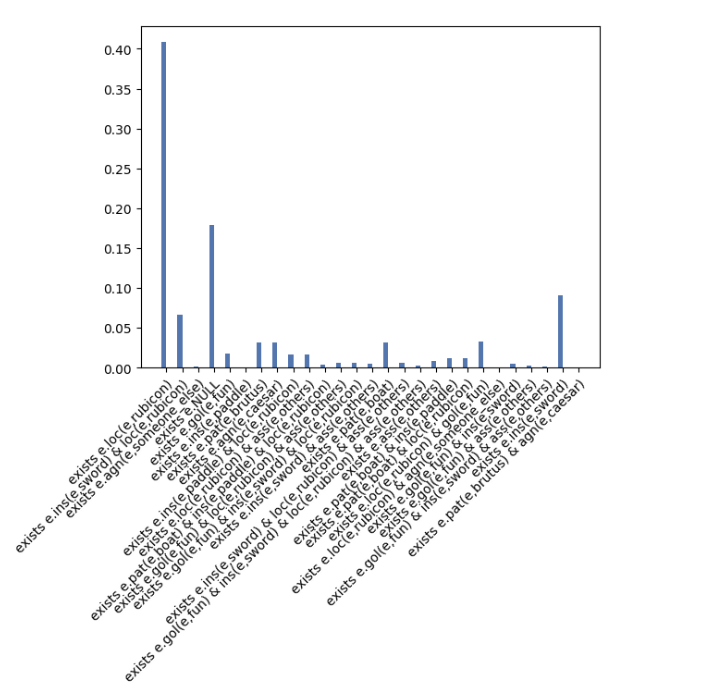

# Probabilistic Pragmatic Modelling of Elliptical Corrections Using First Order Logic Semantic Representations

For the project report see the file report.pdf.

Execution: `cd code && python3 court.py`.

The figure shows what a pragmatic/smart listener infers the belief of a speaker who just made some remark to be, by taking into account their own world knowledge and considering the speaker's possible goals.

---

##### Dependencies
- nltk  
- nltk external prover command (e.g. ResolutionProverCommand)  

- torch  
- pyro  
- matplotlib  

---

search\_inference.py, HashingMarginal and inspiration taken directly from [official pyro github examples](https://github.com/pyro-ppl/pyro/tree/dev/examples/rsa)
The below is taken from the [official pyro github examples](https://github.com/pyro-ppl/pyro/tree/dev/examples/rsa)

## Rational Speech Acts (RSA) examples

This folder contains examples of reasoning about reasoning with nested inference
adapted from work by @ngoodman and collaborators.

- `generics.py`: Taken from [Probabilistic Language Understanding](https://gscontras.github.io/probLang/chapters/07-generics.html)
- `hyperbole.py`: Taken from [Probabilistic Language Understanding](https://gscontras.github.io/probLang/chapters/03-nonliteral.html)
- `schelling.py`: Taken from [ForestDB](http://forestdb.org/models/schelling.html)
- `schelling_false.py`: Taken from [ForestDB](http://forestdb.org/models/schelling-falsebelief.html)
- `search.py`: Inference algorithms used in the example models. Adapted from [Design and Implementation of Probabilistic Programming Languages](http://dippl.org/chapters/03-enumeration.html)
- `semantic_parsing.py`: Taken from [Design and Implementation of Probabilistic Programming Languages](http://dippl.org/examples/zSemanticPragmaticMashup.html)
